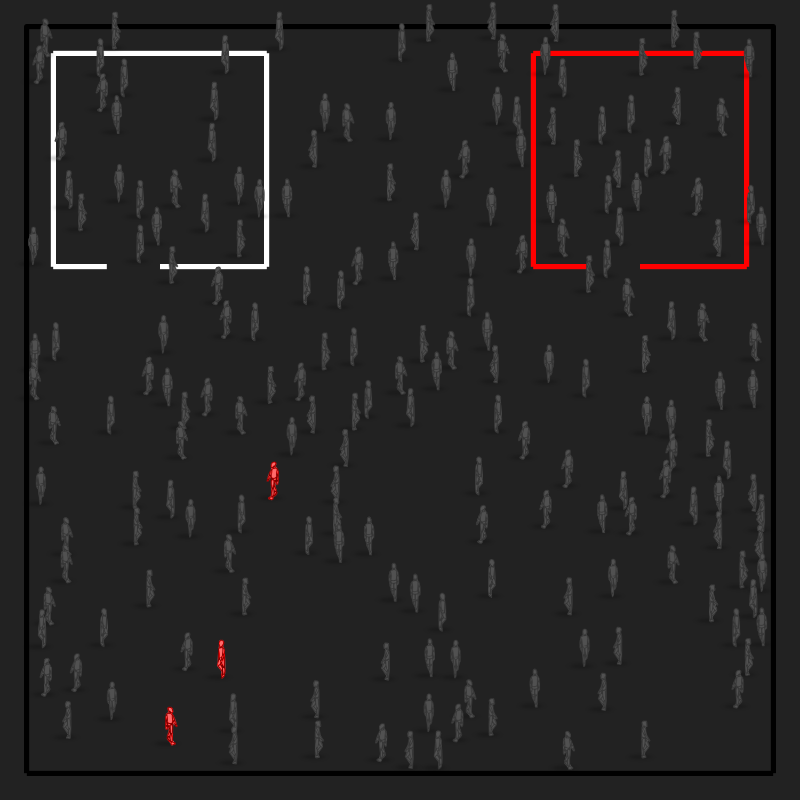

# JS Virus Spread Simulator

Simple toy i started to educate myself about epidemiologic simulation. I'm no doctor, it's just a toy. 

 [@tixlegeek](https://twitter.com/tixlegeek) - [tixlegeek.io](https://tixlegeek.io) 

Copyright (c) 2020 Tixlegeek (MIT, see LICENSE ) - You can do whatever you want with that code.

---

See online demo [Here](https://tixlegeek.io/spreadsimulator/)! 

HppHckng!